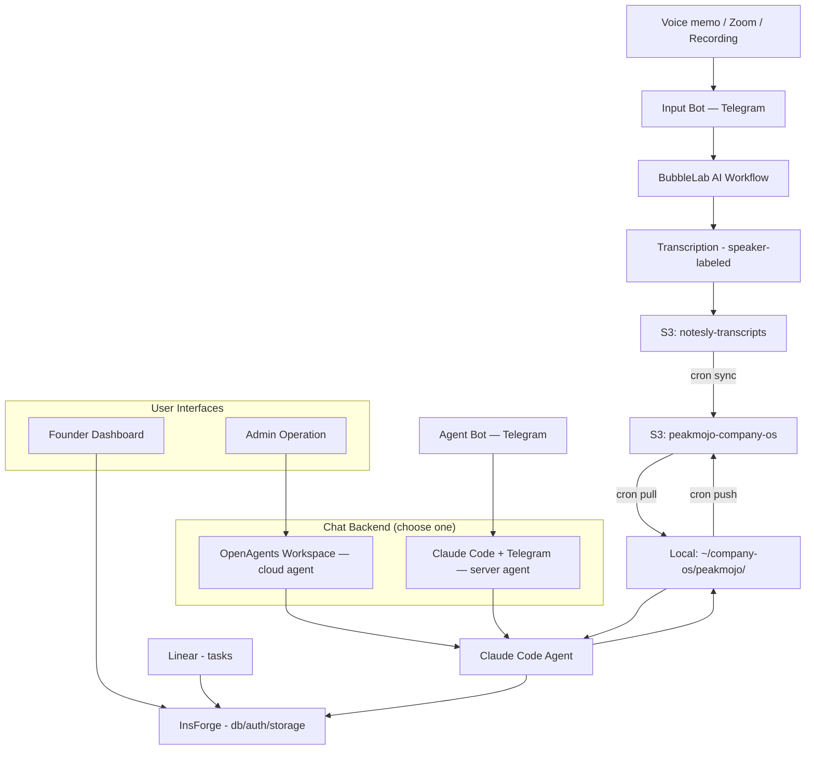

# Company OS

### The open-source startup operating system that turns conversations into structured knowledge and execution.

> An open-source, self-hosted alternative to Otter.ai, Fireflies, and Gong — but instead of just transcribing meetings, Company OS builds a living knowledge base from every conversation your team has.

Every founding team makes their best decisions in conversation. Then loses them.

Code goes in GitHub. Tasks go in Linear. But the verbal decisions, customer insights, strategic pivots, advisor feedback — the stuff that actually shapes your company? There's no system of record for any of it.

**Company OS is that system of record.** A conversation intelligence platform that captures institutional knowledge, tracks decisions, and turns unstructured voice memos and meeting recordings into a searchable, structured second brain for your entire team.

## Dashboard preview


### Built with

[**BubbleLab**](https://github.com/bubblelabai/BubbleLab) — AI workflow engine for file sync, transcription routing, and processing pipelines

[**InsForge**](https://insforge.dev) — AI-native backend: database, auth, storage, edge functions

### Two ways to chat with your knowledge base

Company OS supports two approaches for the AI agent that powers team chat and knowledge processing. Choose the one that fits your setup:

| | **OpenAgents Workspace** | **Claude Code + Telegram** |
|---|---|---|
| **What it is** | Cloud-hosted Claude Cowork agent on [OpenAgents](https://openagents.org) | Claude Code running on Ubuntu with the official [Telegram channel plugin](https://code.claude.com/docs/en/channels) |
| **How it connects** | OpenAgents cloud → your dashboard | Telegram → Claude Code (long-running session on server) |
| **Auth** | OpenAgents account | claude.ai login + Telegram bot token |
| **Best for** | Teams wanting a managed, always-on cloud agent | Teams wanting full file access, local brain processing, and mobile chat via Telegram |
| **Setup** | Deploy workspace on OpenAgents | Run `deploy.sh` on Ubuntu, start Claude Code with `--channels` |
| **Data sync** | Manual | Automated — S3 sync every 5 minutes via cron |

You can switch between the two backends at any time in the dashboard Settings panel — no restart required.

---

## Why this exists

Every company has an operating system. Most aren't conscious of it.

Your OS is how decisions get made, how priorities get shaped, how knowledge gets shared across your team. When it's working, people move fast without asking permission. When it's broken, you spend Monday re-interpreting what "the work" is.

Most startups run their OS on a mix of Slack threads, Google Docs nobody reads, and whatever the CEO remembers from last Tuesday's call. The important stuff lives in people's heads — until they forget it. [42% of institutional knowledge resides solely with individual employees](https://femaleswitch.org/startup-blog/tpost/eal3ieu5s1-top-10-proven-tools-and-strategies-to-do) — when they leave, nearly half of what they knew walks out the door.

I built Company OS because I got tired of my own team losing decisions. We're a 5-person founding team in Techstars. Six meetings a day — investors, customers, advisors, co-founder syncs. A week later, nobody remembers the details.

So I built a system where conversations become structured knowledge, and structured knowledge drives execution.

---

## How it works


### Two Telegram bots, two purposes

Company OS uses two separate Telegram bots:

| | **Input Bot** | **Agent Bot** |
|---|---|---|
| **Purpose** | Send in recordings, voice memos, text notes, images | Chat with your knowledge base, trigger processing |
| **Powered by** | BubbleLab + AssemblyAI | Claude Code + Telegram channel plugin |
| **Runs on** | BubbleLab cloud workflow | Ubuntu server (long-lived Claude Code session) |
| **Output** | Transcripts → S3 (`notesly-transcripts`) | Brain updates, answers, task management |

The Input Bot is your data capture layer. The Agent Bot is your intelligence layer.

---

**Record** — Send a voice memo to the **Input Bot** in Telegram, drop a Zoom meeting recording, or any audio file. Get a transcript back with speaker diarization (speaker labels) in under a minute. Works with any language — auto-detected.

**Structure** — AI processes transcripts into your company's knowledge dimensions. Not a fixed template — the dimensions emerge from your actual conversations. A healthcare startup ends up with `market/`, `validation/`, `regulatory/`. A fintech startup gets `compliance/`, `partnerships/`, `unit-economics/`. Your company, your structure.

**Ask** — Team members chat with the knowledge base through the **Agent Bot** in Telegram. No need to open a terminal or remember where things are — just ask "who did we talk to about X?" or "what did we decide about Y?" and get answers grounded in your actual conversations. Two backends are supported: **OpenAgents Workspace** (cloud-hosted agent with admin interface) or **Claude Code + Telegram** (Claude Code running on a server, accessible via the Agent Bot). Switch between them in Settings.

**Execute** — Tasks sync from Linear into the dashboard. Search across all tasks semantically to find what's relevant.

**See** — The UI doesn't matter — each team member vibe-codes their own dashboard. What matters are the primitives underneath: the structured dimensions, the timeline data, the task state. Think of it as an embedded Lovable — shared components built on shared data, but each person organizes and codes their own view. The CEO sees the vision map. The COO sees the operational tracker. Same data, different views, all AI-generated.

---

## What makes this different

Unlike tools like [Operately](https://operately.com/) (goals and project tracking), [Meetily](https://meetily.ai/) (local meeting transcription), or [Char](https://char.com/) (meeting notepad), Company OS doesn't stop at recording or task management. It connects the full loop: **record → transcribe → structure → query → execute**.

**Decision tracking, not just transcription.** The system doesn't just record meetings — it maintains a decision log that tracks *who decided what, when, and why*. Six months from now, you can trace any strategic decision back to the exact conversation. This is your company's institutional memory.

**Conversations become a knowledge graph.** Raw meeting transcripts get processed into structured, interconnected knowledge dimensions — not just flat notes. Think of it as a second brain for your startup, where every insight, customer quote, and strategic pivot is organized and queryable.

**Your dimensions, not ours.** No predefined schema. No "fill in these 12 boxes." The knowledge structure emerges from your conversations, the way your team actually thinks about your business.

**Self-hosted, your API keys, your data.** Your most sensitive recordings — investor negotiations, co-founder disagreements, customer deal terms — are processed with your own API keys. No data leaves your infrastructure. Privacy-first by design — GDPR and HIPAA friendly.

**Ships as a native macOS desktop app + server agent.** Not just a web tool — Company OS includes an Electron-based desktop app for the dashboard, plus a deployable server agent that runs Claude Code with Telegram integration. Chat with your knowledge base from your phone while the agent processes transcripts on your server.

---

## What's inside

| Layer | What it does | How |
|-------|-------------|-----|
| **Input** | Voice memos, Zoom meetings, recordings, documents | Telegram bot + BubbleLab |
| **Transcription** | Speaker-labeled transcripts with diarization | AssemblyAI (auto language detection) |
| **File sync** | All files centralized in one place | [BubbleLab](https://github.com/bubblelabai/BubbleLab) workflows → Google Drive + S3 |
| **Knowledge processing** | Conversations → structured knowledge dimensions; team Q&A | [OpenAgents Workspace](https://openagents.org) (cloud agent) or [Claude Code + Telegram](https://code.claude.com/docs/en/channels) (server agent) |
| **Backend** | Database, auth, storage, API | [InsForge](https://insforge.dev) — AI-native backend |
| **Execution** | Task sync + semantic search | Linear → InsForge (edge function) |
| **Visualization** | Per-user dashboards, vibe-coded by each team member | React primitives + shared components — **help wanted** |

---

## Quick start

### 1. Transcription bot (5 minutes)

Record conversations, get transcripts. This is your input layer.

```bash
git clone https://github.com/baryhuang/company-os.git
cd company-os
# Set environment variables (see API keys below)
uv run server/telegram_bot.py
```

Send a voice memo to your Telegram bot. Get a speaker-labeled transcript back.

### 2. Desktop app (macOS)

```bash
make install   # install web + Electron deps
make dev       # run Vite + Electron in dev mode
make dmg       # build .dmg for distribution
```

Backend settings (InsForge URL, keys) are configurable in Settings within the app.

### 3. Knowledge processing

Transcripts get processed into your company's dimension structure. Start with whatever makes sense — the system evolves as your company does.

### 3. Your dashboard

Build your own view of your company's knowledge. Use the component library or start from scratch.

---

## API keys

| Key | What it's for | Required? |
|-----|--------------|-----------|
| `TELEGRAM_BOT_TOKEN` | Input Bot — receive voice memos, files, and text | Yes |
| `TELEGRAM_AGENT_BOT_TOKEN` | Agent Bot — Claude Code Telegram channel (configured via `/telegram:configure`) | For Approach 2 |
| `ASSEMBLY_API_KEY` | Transcription with speaker labels | Yes |
| `OPENAI_API_KEY` | AI chat + summarization | Optional |
| `ANTHROPIC_API_KEY` | Knowledge processing | Optional |
| `S3_BUCKET` | Cloud storage sync | Optional |

Get started with just two free API keys: [Telegram BotFather](https://t.me/BotFather) and [AssemblyAI](https://assemblyai.com/app/account).

---

## Comparison

| Feature | Company OS | Otter.ai / Fireflies | Operately | Meetily / Char |
|---------|-----------|---------------------|-----------|---------------|
| Meeting transcription | Speaker-labeled, multi-language | Speaker-labeled | No | Speaker-labeled |
| Knowledge structuring | AI-generated dimensions | Flat summaries | No | Flat notes |
| Decision log & tracking | Full traceability | Basic action items | Goals only | No |
| Team knowledge base chat | Conversational Q&A | Search only | No | No |
| Task management integration | Linear sync + semantic search | Basic integrations | Built-in goals | No |
| Self-hosted / open source | MIT license | SaaS only | Open source | Open source |
| Your API keys, your data | Yes | No | N/A | Yes |
| Per-user customizable dashboards | Vibe-coded views | Fixed UI | Fixed UI | Fixed UI |

---

## Chat Backend Setup

### Approach 1: OpenAgents Workspace (cloud agent)

The default approach. [OpenAgents](https://openagents.org) hosts a Claude Cowork agent in the cloud, providing:

- **Always-on cloud agent** — no local process to manage
- **Admin operation interface** — manage your workspace, agent configuration, and context
- **Team chat** — any team member can query the knowledge base from the dashboard

To set up: create a workspace on [OpenAgents](https://openagents.org), configure it with your Company Brain context and CLAUDE.md, and point your dashboard to it in Settings.

### Approach 2: Claude Code + Telegram (server agent)

Claude Code runs as a long-lived session on an Ubuntu server, connected to Telegram via the official [channel plugin](https://code.claude.com/docs/en/channels). Team members chat with the bot directly from Telegram to trigger brain processing, ask questions, and manage tasks.

### Prerequisites

- **Ubuntu** server with SSH access
- **Claude Code** v2.1.80 or later
- **AWS CLI** configured with access to S3
- **claude.ai** account (login-based auth, no API key needed)
- **Telegram bot token** from [BotFather](https://t.me/BotFather)

### S3 data structure

```
s3://peakmojo-company-os/
  {org-slug}/                          # e.g. "peakmojo"
    brain/                             # shared company brain (source of truth)
      conversations/
      customer_discovery/
      market/
      ...
    context/                           # agent context
      skills/                          # org-specific Claude skills
    by-dates/                          # transcripts + recordings by date
      2026-03-22/
        transcribe-bot_..._transcript.txt
        transcribe-bot_..._audio.mp3
    users/                             # per-user data
      {email}/
        notes/                         # personal markdown
        telegram/                      # bot conversation history
```

### Quick start

```bash
# 1. Deploy on Ubuntu (installs deps, creates dirs, sets up cron)
chmod +x deploy.sh && ./deploy.sh

# 2. Configure AWS credentials
aws configure

# 3. Authenticate Claude Code
claude auth login

# 4. Install Telegram plugin
claude
/plugin marketplace add anthropics/claude-plugins-official
/plugin install telegram@claude-plugins-official
/reload-plugins
/telegram:configure <YOUR_BOT_TOKEN>
# Exit Claude Code

# 5. Start Claude Code with Telegram channel
cd ~/company-os/peakmojo
claude --channels plugin:telegram@claude-plugins-official --dangerously-skip-permissions

# 6. Pair your Telegram account
# Send any message to your bot in Telegram, get a pairing code
/telegram:access pair <code>
/telegram:access policy allowlist
```

### How it works

```
Telegram  ──►  Claude Code (long-running session on Ubuntu)
                    │
                    ├── reads ~/company-os/peakmojo/by-dates/  (transcripts)
                    ├── reads ~/company-os/peakmojo/brain/     (knowledge base)
                    ├── updates brain files locally
                    └── replies via Telegram

Cron (every 5 min):
  1. s3://notesly-transcripts/by-dates/ → s3://peakmojo-company-os/peakmojo/by-dates/
  2. S3 → local (pull by-dates + context)
  3. local → S3 (push brain updates)
```

- BubbleLab writes transcripts to `s3://notesly-transcripts/by-dates/`
- Cron copies new transcripts into the consolidated `peakmojo-company-os` bucket, then syncs to local
- Users message the Telegram bot to trigger processing: "process today's recordings", "what did we decide about X?"
- Claude Code reads local transcript files, updates brain files, and replies via Telegram
- Cron pushes updated brain files back to S3

### Switching between approaches

The Settings panel includes a **Chat Backend** toggle:

- **OpenAgents** (default) — uses the OpenAgents cloud agent (Approach 1)
- **Telegram** — uses the Claude Code Telegram agent (Approach 2)

### Limitations

- **Research preview** — channels require Claude Code v2.1.80+ and the `--channels` flag
- **Single session** — one Claude Code session per Telegram bot
- **Manual start** — Claude Code must be started manually after server reboot (systemd service planned)

---

## Critical TODOs

1. ~~**Company Brain must sync to a shared location.**~~ **Done.** Company Brain is stored in `s3://peakmojo-company-os/peakmojo/brain/` with automated cron sync every 5 minutes. Org-specific skills stored in `peakmojo/context/skills/`.

2. ~~**`by-dates/` and Company Brain must auto-sync to local.**~~ **Done.** Cron syncs transcripts from `s3://notesly-transcripts/by-dates/` → `s3://peakmojo-company-os/peakmojo/by-dates/` → local `~/company-os/peakmojo/by-dates/` every 5 minutes.

3. **Chat-initiated updates must trigger Claude Code to update the database.** When a user requests changes through the Telegram bot (e.g., "mark task X as done", "process today's new recordings"), Claude Code should execute the actual operations — updating task status in the DB, running `upload_brain.py` for new files, etc. The Telegram channel plugin enables this; the processing logic in CLAUDE.md and skills needs to be wired up.

4. **Replace skills with a context layer.** The current agent uses a skill-based architecture (company-brain, social-media, etc.) where each skill has its own SKILL.md. This should be replaced with a **context layer** — a unified CLAUDE.md that includes the Company Brain structure, file locations, database schema, and available operations. The agent should always have the right context loaded, not need to "discover" it per-task.

5. **Auto-deploy OpenAgents workspace.** The OpenAgents workspace (Claude Cowork cloud agent) currently requires manual deployment. This should be automated — when the Company Brain, CLAUDE.md, or agent configuration changes, the workspace should redeploy automatically so the chat agent always reflects the latest context and capabilities.

6. **Embeddable per-user visualization layer.** The processing → backend → data pipeline works. What's missing is a UI framework where the primitives (dimension trees, timelines, task views, competitor landscapes) are shared components, but each team member assembles and customizes their own view using AI code generation. Not a fixed dashboard — a personal operating surface that each person vibe-codes to fit how they think.

---

## Related projects & alternatives

If Company OS isn't the right fit, check out these projects in the space:

- [Operately](https://operately.com/) — Open-source startup operating system focused on goals and project execution
- [Meetily](https://meetily.ai/) — Privacy-first, self-hosted AI meeting transcription (Otter.ai alternative)
- [Char](https://char.com/) — Open-source AI notepad for meetings with local transcription
- [Khoj](https://github.com/khoj-ai/khoj) — Self-hostable AI second brain for personal knowledge management
- [Logseq](https://logseq.com/) — Privacy-first, open-source knowledge base
- [Outline](https://www.getoutline.com/) — Team knowledge base and wiki

---

## Built by

I'm a startup CTO building [PeakMojo](https://peakmojo.com) — AI for healthcare workforce, currently in [Techstars 2026](https://www.techstars.com/).

This is the actual system my team uses to run our company. We've processed 50+ days of meeting transcripts into 16 knowledge dimensions with 800+ structured nodes. Every strategic decision we've made traces back to a conversation.

I open-source it because founders should show their work, not just talk about AI.

---

## License

MIT — use it, fork it, make it yours. That's what open source is for.
