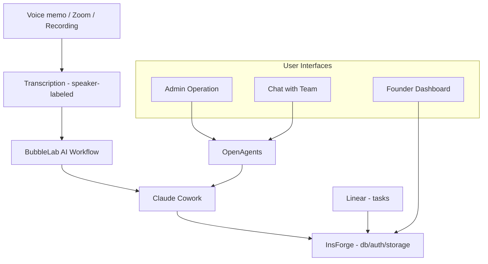

# Company OS

### The open-source startup operating system that turns conversations into structured knowledge and execution.

> An open-source, self-hosted alternative to Otter.ai, Fireflies, and Gong — but instead of just transcribing meetings, Company OS builds a living knowledge base from every conversation your team has.

Every founding team makes their best decisions in conversation. Then loses them.

Code goes in GitHub. Tasks go in Linear. But the verbal decisions, customer insights, strategic pivots, advisor feedback — the stuff that actually shapes your company? There's no system of record for any of it.

**Company OS is that system of record.** A conversation intelligence platform that captures institutional knowledge, tracks decisions, and turns unstructured voice memos and meeting recordings into a searchable, structured second brain for your entire team.

### Built with

[**BubbleLab**](https://github.com/bubblelabai/BubbleLab) — AI workflow engine for file sync, transcription routing, and processing pipelines

[**OpenAgents**](https://openagents.org) — Hosts Claude Cowork in the cloud. Admin operation interface + team chat with your knowledge base

[**InsForge**](https://insforge.dev) — AI-native backend: database, auth, storage, edge functions

---

## Why this exists

Every company has an operating system. Most aren't conscious of it.

Your OS is how decisions get made, how priorities get shaped, how knowledge gets shared across your team. When it's working, people move fast without asking permission. When it's broken, you spend Monday re-interpreting what "the work" is.

Most startups run their OS on a mix of Slack threads, Google Docs nobody reads, and whatever the CEO remembers from last Tuesday's call. The important stuff lives in people's heads — until they forget it. [42% of institutional knowledge resides solely with individual employees](https://femaleswitch.org/startup-blog/tpost/eal3ieu5s1-top-10-proven-tools-and-strategies-to-do) — when they leave, nearly half of what they knew walks out the door.

I built Company OS because I got tired of my own team losing decisions. We're a 5-person founding team in Techstars. Six meetings a day — investors, customers, advisors, co-founder syncs. A week later, nobody remembers the details.

So I built a system where conversations become structured knowledge, and structured knowledge drives execution.

---

## How it works


**Record** — Send a voice memo to Telegram, drop a Zoom meeting recording, or any audio file. Get a transcript back with speaker diarization (speaker labels) in under a minute. Works with any language — auto-detected.

**Structure** — AI processes transcripts into your company's knowledge dimensions. Not a fixed template — the dimensions emerge from your actual conversations. A healthcare startup ends up with `market/`, `validation/`, `regulatory/`. A fintech startup gets `compliance/`, `partnerships/`, `unit-economics/`. Your company, your structure.

**Ask** — Team members chat with the knowledge base directly. No need to open a terminal or remember where things are — just ask "who did we talk to about X?" or "what did we decide about Y?" and get answers grounded in your actual conversations. [OpenAgents](https://openagents.org) hosts the Claude Cowork in the cloud and provides both the admin operation interface and the team chat interface.

**Execute** — Tasks sync from Linear into the dashboard. Search across all tasks semantically to find what's relevant.

**See** — The UI doesn't matter — each team member vibe-codes their own dashboard. What matters are the primitives underneath: the structured dimensions, the timeline data, the task state. Think of it as an embedded Lovable — shared components built on shared data, but each person organizes and codes their own view. The CEO sees the vision map. The COO sees the operational tracker. Same data, different views, all AI-generated.

---

## What makes this different

Unlike tools like [Operately](https://operately.com/) (goals and project tracking), [Meetily](https://meetily.ai/) (local meeting transcription), or [Char](https://char.com/) (meeting notepad), Company OS doesn't stop at recording or task management. It connects the full loop: **record → transcribe → structure → query → execute**.

**Decision tracking, not just transcription.** The system doesn't just record meetings — it maintains a decision log that tracks *who decided what, when, and why*. Six months from now, you can trace any strategic decision back to the exact conversation. This is your company's institutional memory.

**Conversations become a knowledge graph.** Raw meeting transcripts get processed into structured, interconnected knowledge dimensions — not just flat notes. Think of it as a second brain for your startup, where every insight, customer quote, and strategic pivot is organized and queryable.

**Your dimensions, not ours.** No predefined schema. No "fill in these 12 boxes." The knowledge structure emerges from your conversations, the way your team actually thinks about your business.

**Self-hosted, your API keys, your data.** Your most sensitive recordings — investor negotiations, co-founder disagreements, customer deal terms — are processed with your own API keys. No data leaves your infrastructure. Privacy-first by design — GDPR and HIPAA friendly.

---

## What's inside

| Layer | What it does | How |
|-------|-------------|-----|
| **Input** | Voice memos, Zoom meetings, recordings, documents | Telegram bot + BubbleLab |
| **Transcription** | Speaker-labeled transcripts with diarization | AssemblyAI (auto language detection) |
| **File sync** | All files centralized in one place | [BubbleLab](https://github.com/bubblelabai/BubbleLab) workflows → Google Drive + S3 |
| **Knowledge processing** | Conversations → structured knowledge dimensions; team Q&A | [OpenAgents](https://openagents.org) — hosts Claude Cowork in the cloud, provides admin operation + team chat |
| **Backend** | Database, auth, storage, API | [InsForge](https://insforge.dev) — AI-native backend |
| **Execution** | Task sync + semantic search | Linear → InsForge (edge function) |
| **Visualization** | Per-user dashboards, vibe-coded by each team member | React primitives + shared components — **help wanted** |

---

## Quick start

### 1. Transcription bot (5 minutes)

Record conversations, get transcripts. This is your input layer.

```bash
git clone https://github.com/baryhuang/company-os.git
cd company-os
# Set environment variables (see API keys below)
uv run server/telegram_bot.py
```

Send a voice memo to your Telegram bot. Get a speaker-labeled transcript back.

### 2. Knowledge processing

Transcripts get processed into your company's dimension structure. Start with whatever makes sense — the system evolves as your company does.

### 3. Your dashboard

Build your own view of your company's knowledge. Use the component library or start from scratch.

---

## API keys

| Key | What it's for | Required? |
|-----|--------------|-----------|
| `TELEGRAM_BOT_TOKEN` | Receive and reply to messages | Yes |
| `ASSEMBLY_API_KEY` | Transcription with speaker labels | Yes |
| `OPENAI_API_KEY` | AI chat + summarization | Optional |
| `ANTHROPIC_API_KEY` | Knowledge processing | Optional |
| `S3_BUCKET` | Cloud storage sync | Optional |

Get started with just two free API keys: [Telegram BotFather](https://t.me/BotFather) and [AssemblyAI](https://assemblyai.com/app/account).

---

## Comparison

| Feature | Company OS | Otter.ai / Fireflies | Operately | Meetily / Char |
|---------|-----------|---------------------|-----------|---------------|
| Meeting transcription | Speaker-labeled, multi-language | Speaker-labeled | No | Speaker-labeled |
| Knowledge structuring | AI-generated dimensions | Flat summaries | No | Flat notes |
| Decision log & tracking | Full traceability | Basic action items | Goals only | No |
| Team knowledge base chat | Conversational Q&A | Search only | No | No |
| Task management integration | Linear sync + semantic search | Basic integrations | Built-in goals | No |
| Self-hosted / open source | MIT license | SaaS only | Open source | Open source |
| Your API keys, your data | Yes | No | N/A | Yes |
| Per-user customizable dashboards | Vibe-coded views | Fixed UI | Fixed UI | Fixed UI |

---

## Critical TODOs

1. **Company Brain must sync to a shared location.** The Company Brain directory (`company-os/`) currently lives locally. It needs to be synced to a shared, accessible location (S3 or Google Drive) so that all processing agents and team members operate on the same source of truth.

2. **`by-dates/` and Company Brain must auto-sync to local.** Meeting transcripts (`by-dates/`) and the Company Brain should automatically sync down to the local workspace — not require manual pulls. This is the prerequisite for any automated processing pipeline to work reliably.

3. **Chat-initiated updates must trigger Claude Code to update the database.** When a user requests changes through the agent chat (e.g., "mark task X as done", "process today's new recordings"), the agent should execute the actual operations — updating task status in the DB, running `upload_brain.py` for new files, etc. Currently the chat is read-only against the knowledge base; it needs write-back capability.

4. **Replace skills with a context layer.** The current Claude Cowork agent uses a skill-based architecture (company-brain, social-media, xlsx, pptx, pdf, etc.) where each skill has its own SKILL.md and the agent must find and read the right skill file before acting. This should be replaced with a **context layer** — instead of discrete skills the agent switches between, provide a unified context that includes the Company Brain structure, file locations, database schema, and available operations. The agent should always have the right context loaded, not need to "discover" it per-task.

5. **Auto-deploy OpenAgents workspace.** The OpenAgents workspace (Claude Cowork cloud agent) currently requires manual deployment. This should be automated — when the Company Brain, CLAUDE.md, or agent configuration changes, the workspace should redeploy automatically so the chat agent always reflects the latest context and capabilities.

6. **Embeddable per-user visualization layer.** The processing → backend → data pipeline works. What's missing is a UI framework where the primitives (dimension trees, timelines, task views, competitor landscapes) are shared components, but each team member assembles and customizes their own view using AI code generation. Not a fixed dashboard — a personal operating surface that each person vibe-codes to fit how they think.

---

## Related projects & alternatives

If Company OS isn't the right fit, check out these projects in the space:

- [Operately](https://operately.com/) — Open-source startup operating system focused on goals and project execution
- [Meetily](https://meetily.ai/) — Privacy-first, self-hosted AI meeting transcription (Otter.ai alternative)
- [Char](https://char.com/) — Open-source AI notepad for meetings with local transcription
- [Khoj](https://github.com/khoj-ai/khoj) — Self-hostable AI second brain for personal knowledge management
- [Logseq](https://logseq.com/) — Privacy-first, open-source knowledge base
- [Outline](https://www.getoutline.com/) — Team knowledge base and wiki

---

## Built by

I'm a startup CTO building [PeakMojo](https://peakmojo.com) — AI for healthcare workforce, currently in [Techstars 2026](https://www.techstars.com/).

This is the actual system my team uses to run our company. We've processed 50+ days of meeting transcripts into 16 knowledge dimensions with 800+ structured nodes. Every strategic decision we've made traces back to a conversation.

I open-source it because founders should show their work, not just talk about AI.

---

## License

MIT — use it, fork it, make it yours. That's what open source is for.
