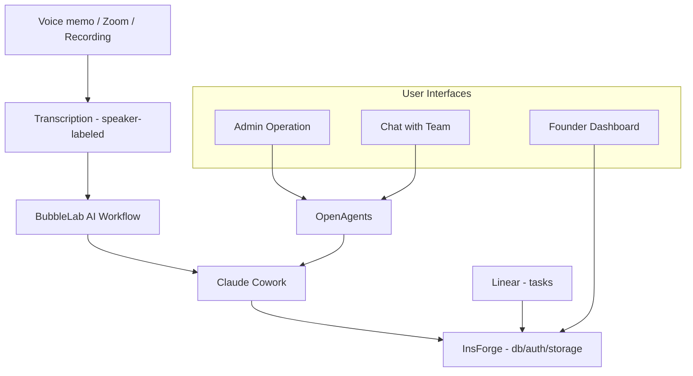

# Company OS

### From conversation to structured knowledge to execution.

Every founding team makes their best decisions in conversation. Then loses them.

Code goes in GitHub. Tasks go in Linear. But the verbal decisions, customer insights, strategic pivots, advisor feedback — the stuff that actually shapes your company? There's no system of record for any of it.

Company OS is that system of record.

### Built with

[**BubbleLab**](https://github.com/bubblelabai/BubbleLab) — AI workflow engine for file sync, transcription routing, and processing pipelines

[**OpenAgents**](https://openagents.org) — Hosts Claude Cowork in the cloud. Admin operation interface + team chat with your knowledge base

[**InsForge**](https://insforge.dev) — AI-native backend: database, auth, storage, edge functions

---

## Why this exists

Every company has an operating system. Most aren't conscious of it.

Your OS is how decisions get made, how priorities get shaped, how knowledge gets shared across your team. When it's working, people move fast without asking permission. When it's broken, you spend Monday re-interpreting what "the work" is.

Most startups run their OS on a mix of Slack threads, Google Docs nobody reads, and whatever the CEO remembers from last Tuesday's call. The important stuff lives in people's heads — until they forget it.

I built Company OS because I got tired of my own team losing decisions. We're a 5-person founding team in Techstars. Six meetings a day — investors, customers, advisors, co-founder syncs. A week later, nobody remembers the details.

So I built a system where conversations become structured knowledge, and structured knowledge drives execution.

---

## How it works


**Record** — Send a voice memo to Telegram, drop a Zoom meeting recording, or any audio file. Get a transcript back with speaker labels in under a minute.

**Structure** — AI processes transcripts into your company's knowledge dimensions. Not a fixed template — the dimensions emerge from your actual conversations. A healthcare startup ends up with `market/`, `validation/`, `regulatory/`. A fintech startup gets `compliance/`, `partnerships/`, `unit-economics/`. Your company, your structure.

**Ask** — Team members chat with the knowledge base directly. No need to open a terminal or remember where things are — just ask "who did we talk to about X?" or "what did we decide about Y?" and get answers grounded in your actual conversations. [OpenAgents](https://openagents.org) hosts the Claude Cowork in the cloud and provides both the admin operation interface and the team chat interface.

**Execute** — Tasks sync from Linear into the dashboard. Search across all tasks semantically to find what's relevant.

**See** — The UI doesn't matter — each team member vibe-codes their own dashboard. What matters are the primitives underneath: the structured dimensions, the timeline data, the task state. Think of it as an embedded Lovable — shared components built on shared data, but each person organizes and codes their own view. The CEO sees the vision map. The COO sees the operational tracker. Same data, different views, all AI-generated.

---

## What makes this different

**Clarity over consensus.** The system doesn't just record meetings — it tracks *who decided what, when, and why*. Six months from now, you can trace any strategic decision back to the exact conversation.

**Deliberate documentation.** Decisions, learnings, and direction live somewhere visible — not in someone's head, not in a Slack thread that scrolled away. Structured data, searchable, always up to date.

**Your dimensions, not ours.** No predefined schema. No "fill in these 12 boxes." The knowledge structure emerges from your conversations, the way your team actually thinks about your business.

**Your API keys, your data.** Your most sensitive recordings — investor negotiations, co-founder disagreements, customer deal terms — are processed with your own API keys.

---

## What's inside

| Layer | What it does | How |
|-------|-------------|-----|
| **Input** | Voice memos, Zoom meetings, recordings, documents | Telegram bot + BubbleLab |
| **Transcription** | Speaker-labeled transcripts | AssemblyAI |
| **File sync** | All files centralized in one place | [BubbleLab](https://github.com/bubblelabai/BubbleLab) workflows → Google Drive + S3 |
| **Processing + Chat** | Conversations → structured knowledge; team Q&A | [OpenAgents](https://openagents.org) — hosts Claude Cowork in the cloud, provides admin operation + team chat |
| **Backend** | Database, auth, storage, API | [InsForge](https://insforge.dev) — AI-native backend |
| **Execution** | Task sync + semantic search | Linear → InsForge (edge function) |
| **Visualization** | Per-user dashboards, vibe-coded by each team member | React primitives + shared components — **help wanted** |

---

## Quick start

### 1. Transcription bot (5 minutes)

Record conversations, get transcripts. This is your input layer.

```bash
git clone https://github.com/baryhuang/company-os.git
cd company-os
# Set environment variables (see API keys below)
uv run server/telegram_bot.py
```

Send a voice memo to your Telegram bot. Get a speaker-labeled transcript back.

### 2. Knowledge processing

Transcripts get processed into your company's dimension structure. Start with whatever makes sense — the system evolves as your company does.

### 3. Your dashboard

Build your own view of your company's knowledge. Use the component library or start from scratch.

---

## API keys

| Key | What it's for | Required? |
|-----|--------------|-----------|
| `TELEGRAM_BOT_TOKEN` | Receive and reply to messages | Yes |
| `ASSEMBLY_API_KEY` | Transcription with speaker labels | Yes |
| `OPENAI_API_KEY` | AI chat + summarization | Optional |
| `ANTHROPIC_API_KEY` | Knowledge processing | Optional |
| `S3_BUCKET` | Cloud storage sync | Optional |

Get started with just two free API keys: [Telegram BotFather](https://t.me/BotFather) and [AssemblyAI](https://assemblyai.com/app/account).

---

## Deploy

**Docker** (any server):
```bash
docker compose up -d
```

Runs anywhere Docker runs — a $5 VPS, a Raspberry Pi, or your laptop. No inbound ports needed.

---

## Help wanted

The processing → backend → data pipeline works. What's missing is the **visualization layer** — the part where each team member gets their own vibe-coded dashboard.

The vision: an embeddable UI framework where the primitives (dimension trees, timelines, task views, competitor landscapes) are shared components, but each person assembles and customizes their own view using AI code generation. Not a fixed dashboard — a personal operating surface that each team member codes to fit how they think.

If you're interested in building this layer — React components, AI-assisted UI generation, or the glue between structured data and personalized dashboards — open an issue or reach out.

---

## Built by

I'm a startup CTO building [PeakMojo](https://peakmojo.com) — AI for healthcare workforce, currently in [Techstars 2026](https://www.techstars.com/).

This is the actual system my team uses to run our company. We've processed 50+ days of meeting transcripts into 16 knowledge dimensions with 800+ structured nodes. Every strategic decision we've made traces back to a conversation.

I open-source it because founders should show their work, not just talk about AI.

---

## License

MIT — use it, fork it, make it yours. That's what open source is for.